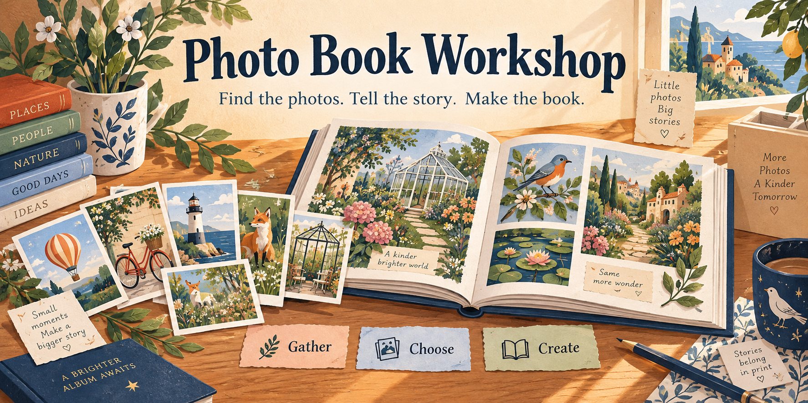

# Photo Book Workshop

**Turn a pile of photos into a book you can actually finish.** Find promising pictures, arrange them on pages, compare a few captions, and make a PDF you can review together.

> **Start here:** download the project, open its starter, and try the invented example. You do not need a GitHub account, an AI subscription, or any of your own photos. The first setup downloads software; the example then runs on your computer.

I built this for me and my own photo-book projects. It keeps the whole workshop: the photo catalog, selection tools, two layout approaches, caption review, and printable proofs. The public example uses entirely invented illustrations and words.

Make it your own, and feel free to improve mine. Hopefully it gives you a useful starting point, or at the very least some ideas. Cheers!

[Open the five-page invented sample PDF](docs/assets/example-book.pdf) to see the result before installing anything.

## Try it, even if you do not write code

1. **[Download the latest release](https://github.com/jessecmaddox3/photo-book-workshop/releases/latest).** Choose `photo-book-workshop-1.0.0.zip`, then extract the ZIP into a normal folder. Do not run it from inside the ZIP.
2. **Install [Python](https://www.python.org/downloads/), version 3.12 or newer.** On Windows, enable “Add Python to PATH” if the installer offers it. Already have Python? You can skip this step.
3. **Open the starter in the extracted folder:** `Start.command` on Mac or `Start.cmd` on Windows. On Linux, open a terminal in that folder and run `sh Start.sh`.
4. **Give the first setup a minute.** A browser page opens with the sample book. Try a caption, add a note, and click **Make proof**. The starter prints the folder where your copy is saved.

Keep the terminal window open while reviewing. When finished, press **Ctrl+C** there. Open the same starter to return to your saved example. [Step-by-step help and troubleshooting](docs/GETTING-STARTED.md) explain what the files and buttons do, including opening the starter if your computer does not recognize it.

## What is in the workshop?

| Part | What you can do |
| --- | --- |
| Gather | Index explicitly chosen Google Photos Takeout ZIP parts. Keep album membership, alternate originals, dates and metadata in your own local catalog. |
| Choose | Search and rank candidates, print numbered contact sheets, and turn picks into stable image IDs. |
| Arrange | Use automatic photo mosaics or deliberately composed rows. Set crops, cover ideas, text panels, placeholders, borders and page dimensions. |
| Review | Compare caption options, make an explicit choice, leave notes, and handle conflicting edits without silently losing words. |
| Make | Build a PDF, individual HTML pages, caption checklists, a pick sheet and a layout/resolution report. Optional browser captures produce page images. |
| Caption | Write descriptions yourself, use your own Codex setup, or deliberately enable paid OpenAI Batch captions with a small reviewed trial first. |

**Your own book needs a page plan.** This is a working toolkit and local caption-review app, not a drag-and-drop photo-book designer or a printing service. The sample shows the full process; [the own-photos guide](docs/OWN-PHOTOS.md) shows how to adapt it. An AI assistant can help using the [included skill](skills/photo-book-workshop/SKILL.md).


*An actual page built from the invented example. The banner at the top is promotional artwork.*

## If you are comfortable with a terminal

From the extracted project folder:

```sh
python3 -m venv .venv
.venv/bin/python -m pip install .
.venv/bin/photo-book start --directory ../my-photo-book-example
```

On Windows use `py -3 -m venv .venv`, then `.venv\Scripts\python -m pip install .` and `.venv\Scripts\photo-book start --directory ..\my-photo-book-example`.

For a noninteractive example, replace `start` with `demo` and choose a new directory. Optional features are separate extras: `.[api]`, `.[browser]`, and `.[decoders]`. [All commands and the book format](docs/REFERENCE.md) are documented.

## How I designed it

The catalog is private working material. Selected images become normalized, metadata-free derivatives with content hashes. A book plan names those images and keeps layout decisions explicit. The same geometry drives PDF and browser proofs, so crops and page sizes can be checked instead of guessed.

Caption review is a separate step. Looking at an option does not choose it; notes stay notes. Saved choices are tied to the exact book and options. If two tabs edit the same page, the app asks which version to keep. A new proof goes in a new folder so an unsuccessful rebuild cannot replace the last good copy.

[Design notes](docs/DESIGN.md) explain the algorithms, tradeoffs and recovery model. [Optional AI instructions](docs/OPTIONAL-AI.md) explain exactly what leaves your computer, how costs are estimated, and how to recover interrupted work.

## A few practical boundaries

- The ordinary workflow has no analytics, account requirement or network photo service. Keep your catalog, books, notes and exported proofs private unless you mean to share them.
- AI is optional. Enabling it sends selected preview images and any explicitly selected context to your configured service. Local estimates are **not** a provider billing cap.
- Outputs are review proofs. Check every page, crop, font, resolution, bleed and your printer’s requirements before ordering. The example art is not a demonstration of photographic print quality.
- Text uses bundled Latin-oriented fonts. Check the actual glyphs when using other writing systems. JPEG and PNG work out of the box; HEIF/RAW support needs optional decoders and varies by file.

## Use it freely

The code is [MIT licensed](LICENSE): use, change, share or sell your version, keeping the license notice. Bundled fonts retain their own OFL notices. [Artwork and source notices](NOTICE.md) explain the example assets.

Useful contributions include more image-format fixtures, page-plan editors, accessible review improvements, layout ideas and printer-specific export adapters. [Contribution instructions](CONTRIBUTING.md) include the tests. Please use invented examples in public issues; [report security problems privately](SECURITY.md).
